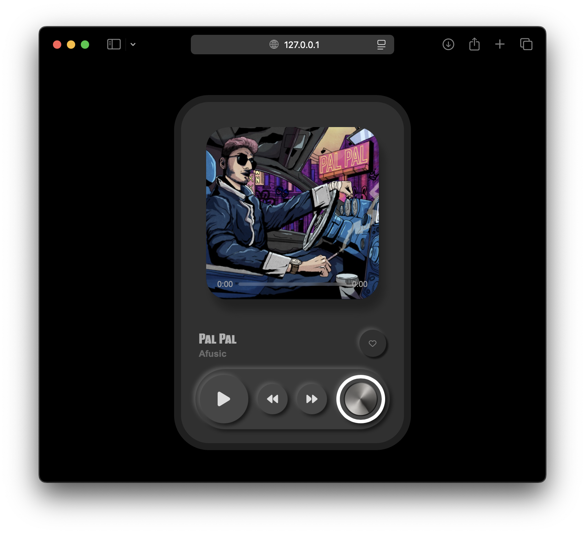
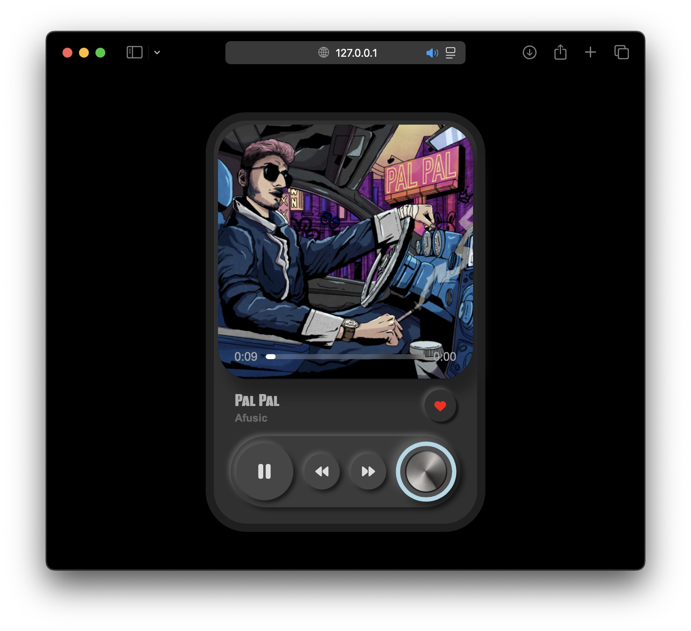

# 🎵 Custom Web Music Player

A sleek and interactive music player built with **HTML**, **CSS**, and **JavaScript**, featuring animated controls, a volume knob, dynamic album covers, and a responsive UI.

## ▶️ Preview




## 🔧 Features

- 🎧 Play, Pause, Next, and Previous song controls
- 🖼️ Album cover background sync
- 💓 Add/remove favorite songs
- 🎚️ Volume control knob (rotatable)
- 📊 Interactive progress bar with seeking
- ⏱️ Live time & duration display
- 🎨 Smooth animations and stylish neumorphism

## 🖥️ Tech Stack

- **HTML5**
- **CSS3** with Google Fonts and Font Awesome
- **Vanilla JavaScript**

## 🚀 Getting Started

1. Clone the repository or download the files:
   ```bash
   git clone https://github.com/your-username/music-player.git
    ```
2. Make sure your directory structure matches the one above.
3. Open index.html in your browser.
4. Enjoy your custom music player!


## 📝 Customize

- Replace songs in the assets/ folder.
- Update SongList in script.js with your new titles, artist names, and paths.
- Change fonts or colors in style.css to match your brand or mood.

## 🛠️ Setup

1. Place your songs in /assets/song#/
2. Add them to the SongList array in script.js:
```js
new Song("My Track", "Artist", "assets/myfolder/music.mp3", "assets/myfolder/cover.png")
```
3. Open index.html in your browser

## 📃 License
Free to use and modify for personal or educational purposes.

Made with ❤️ by Aditya Tripathi